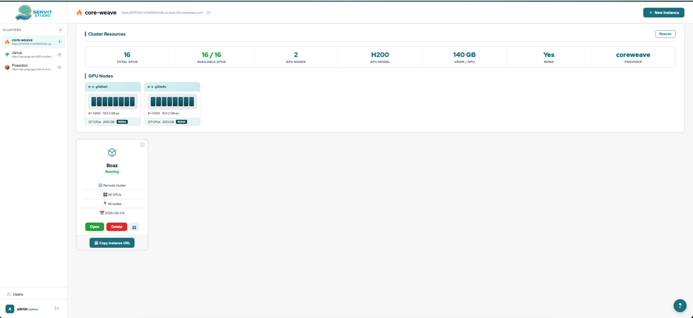
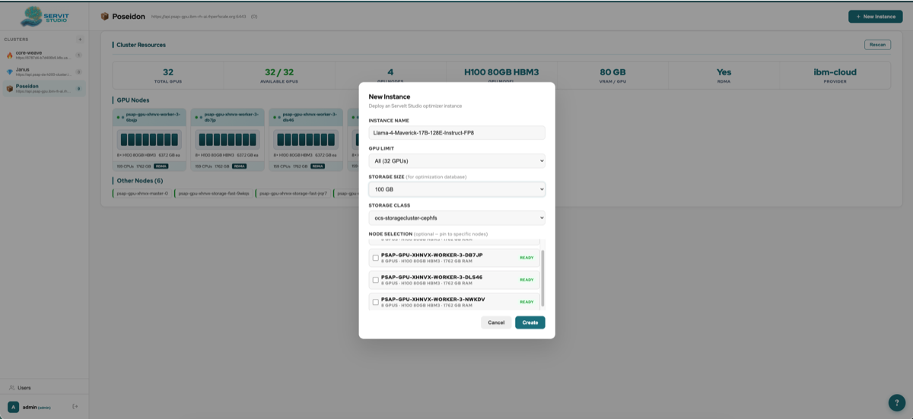
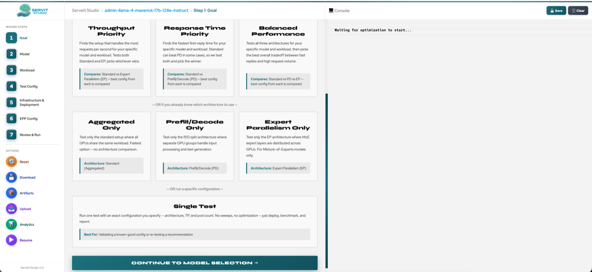
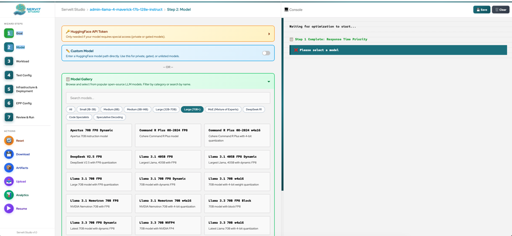
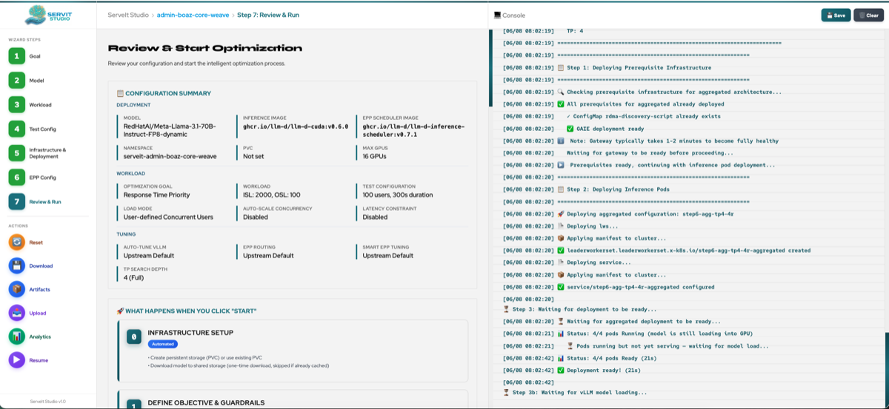
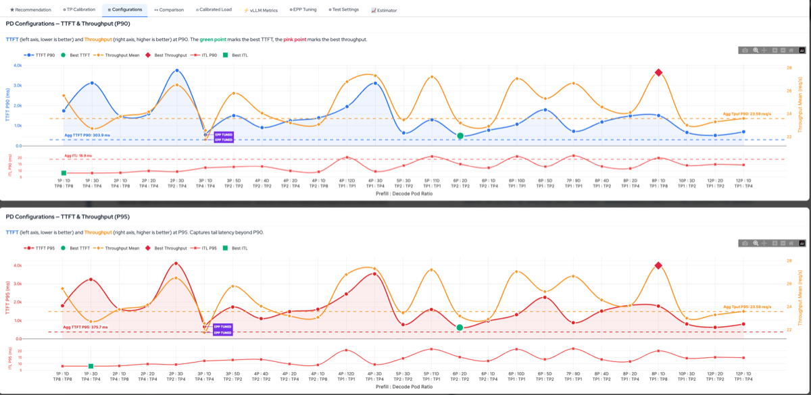

<p align="center">
  
</p>

<p align="center">
  <strong>Automated LLM inference optimization for Kubernetes</strong><br>
  Find the optimal vLLM configuration for your hardware, model, and workload — automatically.
</p>

---

ServeIt Studio deploys real vLLM instances on your cluster, sweeps configurations across aggregated, prefill/decode disaggregated (PD), and expert parallel (EP) architectures, tunes engine parameters from first principles, and returns the optimal setup — ranked by TTFT, throughput, or both.

## Screenshots

### Multi-Cluster Launcher

Manage multiple clusters and optimization instances from a single dashboard. Each cluster shows GPU nodes, VRAM, RDMA capability, and running instances.



### Create a New Instance

Deploy a new optimization instance to any cluster. Select GPU count, storage class, and pin to specific nodes.



### Choose Your Optimization Goal

Select from response time, throughput, balanced, or architecture-specific strategies. Each goal tests different architectures and applies different optimization heuristics.



### Model Gallery

Browse and select from popular open-source LLM models. Filter by size category, architecture (Dense, MoE, Code, Speculative), and quantization format.



### Review & Run

Review your full configuration summary — deployment, workload, and tuning settings — then start the automated optimization pipeline. Live console output shows progress in real time.



### Optimization Report — Throughput vs Latency

Interactive scatter plot showing every tested configuration. Bubble size represents GPU count. The ideal configuration is in the top-left corner (low latency + high throughput). Hover over any bubble to see the exact configuration details.


### PD Configuration Sweep

TTFT, throughput, and inter-token latency (ITL) across all tested prefill/decode splits. The green dot marks the best TTFT, the pink diamond marks the best throughput. Aggregated baseline shown as dashed reference lines.



### GPU Estimator

Estimate how many GPUs you need for a different workload without re-running tests. Adjust concurrency, ISL/OSL, and set a latency SLA — the estimator scales your tested results and shows which configurations meet the target and how many GPUs each would need.


## How It Works

ServeIt Studio supports three inference architectures:

| Architecture | Description | Optimizes For |
|---|---|---|
| **Aggregated** | Single vLLM deployment (baseline) | Simplicity |
| **Prefill/Decode (PD)** | Separate prefill and decode pods with KV cache transfer via NIXL/RDMA | Response time (TTFT) |
| **Expert Parallelism (EP)** | PD disaggregation with expert-parallel flags for MoE models | Throughput |

The optimizer selects which architectures to test based on the goal:

- **Response Time** — Aggregated vs PD
- **Throughput** — Aggregated vs EP
- **Balanced** — All three
- **Aggregated Only / PD Only / EP Only** — Test a single architecture

### The 11-Step Pipeline

1. **Prerequisite Infrastructure** — Deploy gateway, EPP, RBAC, RDMA discovery
2. **Decode TP Sweep** — Deploy aggregated vLLM at each TP (1, 2, 4, 8), measure decode TPSG
3. **Prefill TP Sweep** — Same for prefill workloads (often different optimal TP)
4. **Cluster Capacity Analysis** — Calculate GPU cost per request, sustainable throughput
5. **GPU Sizing & Feasible Splits** — Enumerate valid P/D GPU divisions respecting TP constraints
6. **Aggregated Configuration Search** — Test all aggregated configs (TP1×16R, TP2×8R, etc.)
7. **P/D / EP Split Optimization** — Test selected splits, find Pareto front (or best throughput for EP)
8. **Architecture Comparison** — Compare best PD/EP vs best Aggregated (no new tests)
9. **EPP Tuning** — Smart EPP weight derivation from Prometheus metrics (optional)
10. **Latency-Bounded Throughput** — Binary search for max throughput under latency SLA (optional)
11. **Calibrated Load Validation** — Re-test at sustainable QPS computed via Little's Law (optional)

Steps 2-3 and 6-11 deploy real workloads. Steps 4-5 are pure math.

### Smart Features

#### Model Intelligence
- **Config from HuggingFace** — Reads `config.json` for model size, dtype, MoE detection, hybrid attention, FP8 compatibility. Handles multimodal nested configs (Llama-4 `text_config`), interleaved MoE layers, and compressed-tensors quantization
- **Workload-aware min TP** — Computes minimum TP from model weights + framework overhead + KV cache budget for the actual workload (ISL × OSL × concurrency). Adapts to GQA vs full attention (8 KV heads vs 128)
- **FP8 block quantization filter** — Auto-excludes TP values where `shared_expert_intermediate_size / TP < 128` (FP8 block_n constraint)
- **DeepGemm compatibility** — Detects compressed-tensors per-channel FP8 and disables DeepGemm; enables for standard per-tensor FP8
- **Hybrid attention detection** — Detects `attention_chunk_size` and hybrid architectures, passes `--no-disable-hybrid-kv-cache-manager` for PD

#### Auto-Computed vLLM Parameters
- **gpu_memory_utilization** — Profiled from actual VRAM usage after model load, or estimated from model size and GPU capacity
- **max_num_seqs** — Multi-factor formula: `min(S_activation, S_kv, S_concurrency, 512)` — adapts per model (Qwen gets 192, Llama gets 1,433 at same TP)
- **max_num_batched_tokens** — Computed from measured prefill TPSG × target batch latency
- **block_size** — Auto-tuned from sequence length: `next_power_of_2(sqrt(ISL+OSL))`, min 128 for PD (NIXL block transfer)
- **moe_dp_chunk_size** — Smart formula for EP decode: `min(S_seq, S_expert_capacity, S_dispatch, 512)`
- **kv_cache_memory_bytes** — Profiled decode KV cache budget from calibration memory data
- **DBO threshold** — Scaled by expert count: 32 for 128+ experts, 48 for 32+, 64 for smaller MoE

#### Search & Optimization
- **Smart PD Search** — Calculates optimal P/D split from calibration TPSG, tests ~3 configs per TP pair instead of exhaustive sweep (50+ → ~12 tests)
- **Smart EPP weights** — Two-pass refinement: start from preset, adjust ±1 based on Prometheus metrics (prefix cache hit rate, queue depth, KV utilization), then refine with A/B guardrail
- **Pareto front** — Identifies configurations where no other config has both lower TTFT AND higher throughput
- **Calibrated load** — Per-architecture concurrency computed via Little's Law from measured throughput and response time
- **Latency-bounded search** — Binary search for maximum throughput under a TTFT SLA constraint
- **Asymmetric TP** — Prefill TP ≤ Decode TP is always allowed. Prefill TP > Decode TP is disabled by default (NIXL KV transfer requires matching or lower prefill TP)

#### Infrastructure & Operations
- **Multi-cluster launcher** — Manage optimization instances across multiple Kubernetes/OpenShift clusters from a single dashboard
- **Resume** — Resume interrupted runs from the last completed test. Per-architecture resume skips completed architectures, not the entire step
- **Artifact management** — Download raw test artifacts (guidellm JSON, Prometheus metrics, manifests, configs) per test
- **Database persistence** — All results, configs, and metrics stored in SQLite with full run history. Resume, compare, and reuse across sessions
- **GPU Estimator** — Scale tested results to different workloads (ISL, OSL, concurrency, turns) without re-running tests. Shows GPU requirements for SLA targets
- **Report analytics** — Interactive Plotly charts: Pareto front, PD configuration sweep with ITL subplot, throughput vs latency scatter, GPU efficiency, TP calibration, calibrated load analysis, EPP weight comparison, run comparison
- **Downloadable reports** — HTML and raw artifact download for offline analysis and sharing
- **Prefix cache simulation** — Generate multi-group prefix cache datasets with configurable hit rate, group count, and seed for reproducible workloads
- **Pod error detection** — Auto-detects OOM, CUDA errors, and crash loops during tests; stops optimization and preserves pods for investigation
- **Stop at any time** — Stop checks at every stage of test execution (before deploy, after deploy, during model load, before benchmark)

## Prerequisites

- Kubernetes or OpenShift cluster with NVIDIA GPUs
- [LeaderWorkerSet](https://github.com/kubernetes-sigs/lws) CRD installed
- [Istio](https://istio.io/) gateway provider (for EPP routing)
- `kubectl` (or `oc`) CLI configured
- A HuggingFace token stored as Secret `llm-d-hf-token` in the target namespace

## Deployment

### Quick Start

```bash
# 1. Create the namespace
kubectl create namespace serveit

# 2. Create HuggingFace token secret
kubectl create secret generic llm-d-hf-token \
  --from-literal=HF_TOKEN=<your-token> \
  -n serveit

# 3. Deploy ServeIt Studio (launcher mode)
python3 deployment/deploy.py --mode launcher --storage-class <your-class> -n serveit

# 4. Access the UI
python3 deployment/deploy.py --port-forward -n serveit
# Opens http://localhost:8080
```

On OpenShift, a Route is created automatically:

```bash
oc get route -n serveit
```

### Deployment Modes

| Mode | Command | Description |
|---|---|---|
| **Launcher** (default) | `--mode launcher` | Multi-user dashboard. Create instances per cluster, each with its own optimization environment |
| **Standalone** | `--mode local` | Single-instance deployment. Direct access to the optimization wizard |

### Common Commands

```bash
# Deploy with an existing PVC (skip PVC creation)
python3 deployment/deploy.py --pvc-name my-existing-pvc -n serveit

# Sync code to all running pods (after git pull)
python3 deployment/deploy.py --sync-all -n serveit

# Restart the server process
python3 deployment/deploy.py --restart-server -n serveit

# Generate YAML without deploying (for review or GitOps)
python3 deployment/deploy.py --just-yaml --storage-class <your-class> -n serveit
```

### Remote Clusters

The launcher supports optimizing models on remote clusters. When creating a new instance, upload a kubeconfig for the target cluster. ServeIt Studio will:

1. Validate connectivity to the remote cluster
2. Store the kubeconfig as a Kubernetes Secret
3. Deploy workload pods (vLLM, guidellm, EPP) on the remote cluster
4. Collect results back to the launcher's database

The wizard pod runs on the launcher cluster; only the inference workload runs remotely.

## Multi-Cloud Support

ServeIt Studio auto-detects the cloud provider and configures networking accordingly:

| Provider | GPU Resource | Networking | RDMA |
|---|---|---|---|
| IBM Cloud | DRA (`dra.llm-d.io/gpu-nic-pair`) | DRANet | InfiniBand via DRA |
| CoreWeave | `nvidia.com/gpu` + `rdma/ib` | Shared device plugin | InfiniBand via device plugin |
| Bare Metal | `nvidia.com/gpu` | NAD (Multus) | InfiniBand via Multus |
| AWS / Azure / GCP | `nvidia.com/gpu` | Standard | Provider-specific |

## Metrics

**Client-side** (via [guidellm](https://github.com/vllm-project/guidellm)):
- TTFT (p50, p90, p95, p99)
- Inter-token latency (ITL)
- Throughput (requests/sec)
- TPOT (time per output token)

**Server-side** (via Prometheus/Thanos):
- vLLM TTFT, ITL, E2E latency percentiles
- Token throughput, request queue depth, KV cache utilization
- Pod network and InfiniBand RDMA throughput

Results are stored in SQLite at `/mnt/storage/serveit.db`.

## Project Structure

```
core/                          # Optimization engine
├── optimizer/                 #   Pipeline, config builder, TP calibration, PD search
├── orchestrator/              #   Deploy → benchmark → collect → cleanup
├── templates/                 #   Jinja2 K8s manifests (aggregated, PD, prereqs)
├── networking/                #   Network plugins (DRA, NAD, shared device)
└── providers/                 #   Cloud provider adapters

web/                           # Flask + SocketIO web UI
├── static/                    #   CSS, JS modules, images
└── templates/                 #   HTML wizard steps

launcher/                      # Multi-user launcher
├── app.py                     #   Flask API + dashboard
├── instance_manager.py        #   Instance lifecycle (create, delete, list)
└── templates/                 #   Launcher HTML

deployment/
└── deploy.py                  #   Deploy, sync, port-forward CLI
```

## License

[Apache 2.0](LICENSE)
