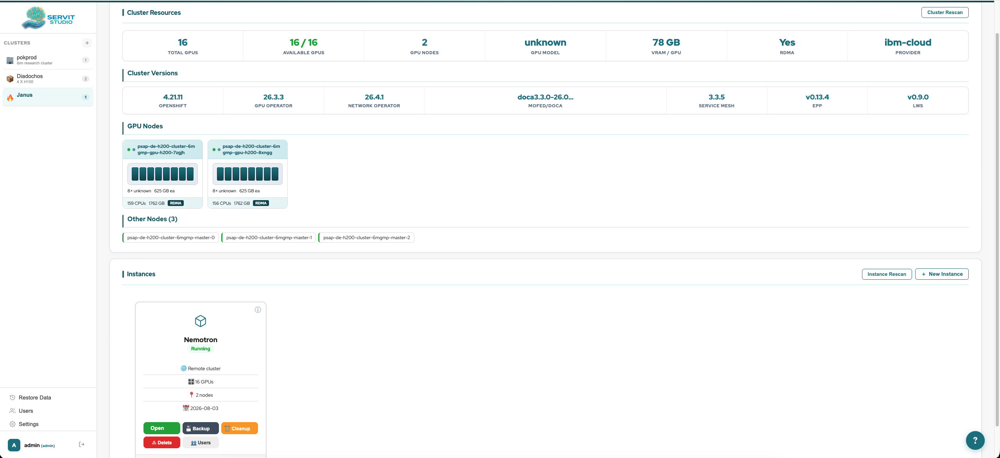
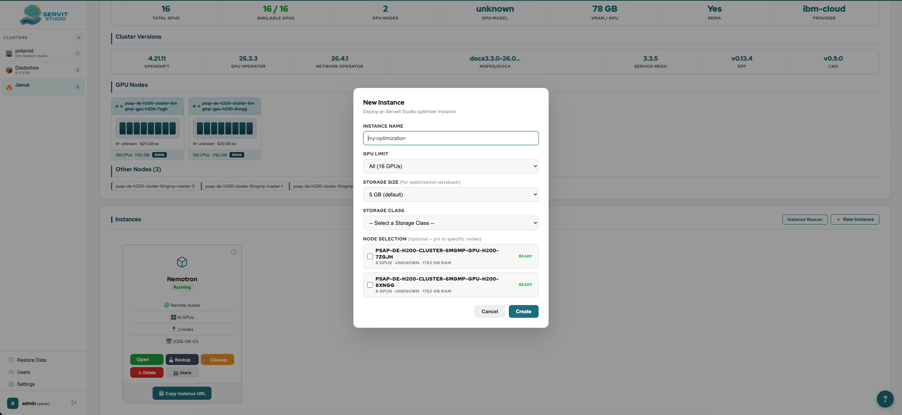
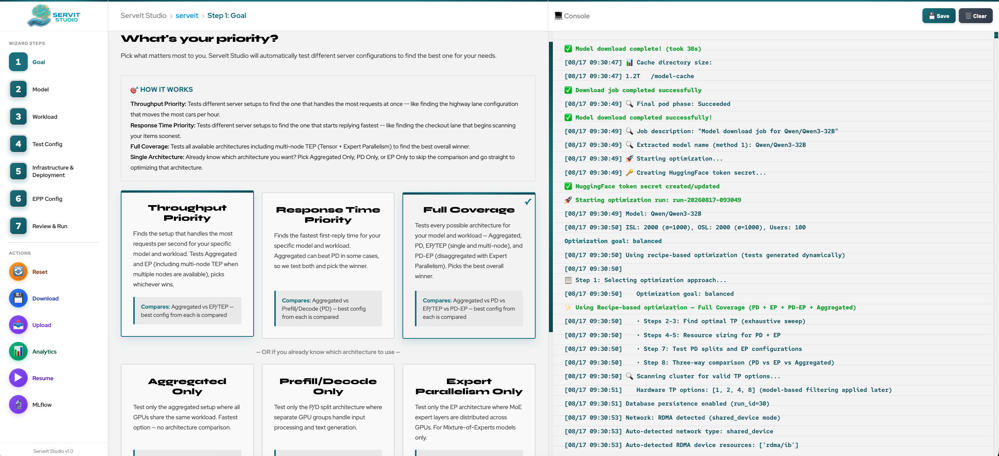
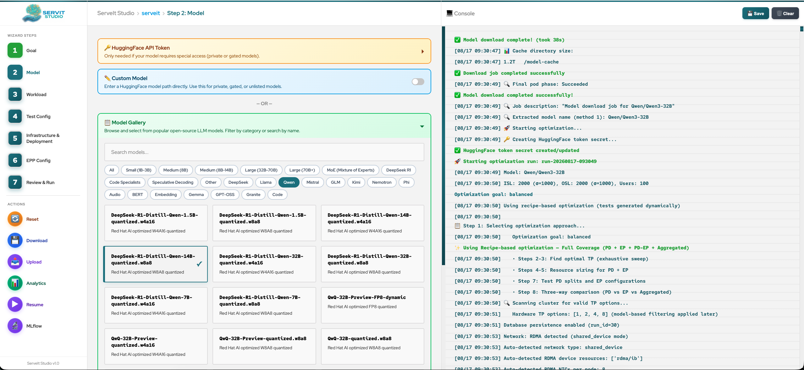
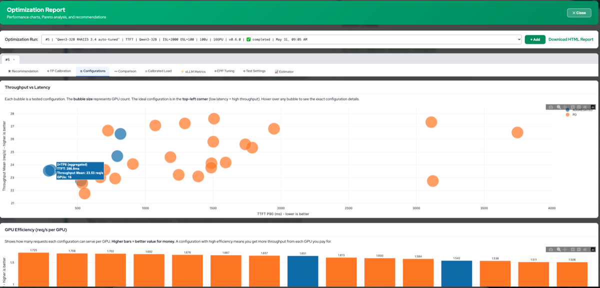
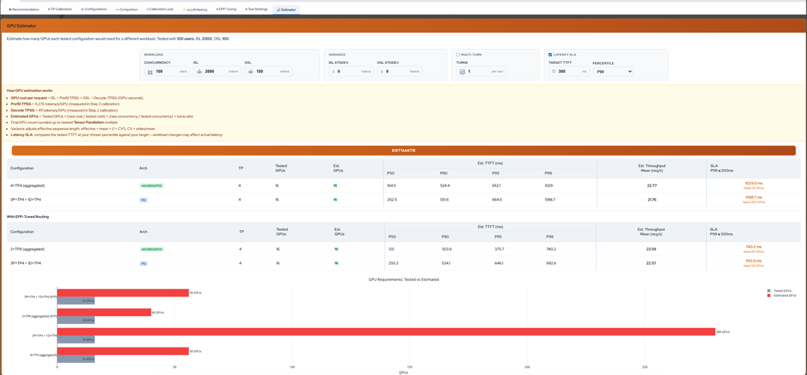

<p align="center">
  
</p>

<p align="center">
  <strong>Automated LLM inference optimization for Kubernetes</strong><br>
  Find the optimal vLLM configuration for your hardware, model, and workload — automatically.
</p>

---

ServeIt Studio deploys real vLLM instances on your cluster, sweeps configurations across aggregated, prefill/decode disaggregated (PD), and expert parallel (EP) architectures, tunes engine parameters from first principles, and returns the optimal setup — ranked by TTFT, throughput, or both.

## Screenshots

### Multi-Cluster Launcher

Manage multiple clusters and optimization instances from a single dashboard. Each cluster shows GPU nodes, VRAM, RDMA capability, and running instances.



### Create a New Instance

Deploy a new optimization instance to any cluster. Select GPU count, storage class, and pin to specific nodes.



### Choose Your Optimization Goal

Select from response time, throughput, balanced, or architecture-specific strategies. Each goal tests different architectures and applies different optimization heuristics.



### Model Gallery

Browse and select from popular open-source LLM models. Filter by size category, architecture (Dense, MoE, Code, Speculative), and quantization format.



### Review & Run

Review your full configuration summary — deployment, workload, and tuning settings — then start the automated optimization pipeline. Live console output shows progress in real time.


### Optimization Report — Throughput vs Latency

Interactive scatter plot showing every tested configuration. Bubble size represents GPU count. The ideal configuration is in the top-left corner (low latency + high throughput). Hover over any bubble to see the exact configuration details.



### PD Configuration Sweep

TTFT, throughput, and inter-token latency (ITL) across all tested prefill/decode splits. The green dot marks the best TTFT, the pink diamond marks the best throughput. Aggregated baseline shown as dashed reference lines.


### GPU Estimator

Estimate how many GPUs you need for a different workload without re-running tests. Adjust concurrency, ISL/OSL, and set a latency SLA — the estimator scales your tested results and shows which configurations meet the target and how many GPUs each would need.



## How It Works

ServeIt Studio supports three inference architectures:

| Architecture | Description | Optimizes For |
|---|---|---|
| **Aggregated** | Single vLLM deployment (baseline) | Simplicity |
| **Prefill/Decode (PD)** | Separate prefill and decode pods with KV cache transfer via NIXL/RDMA | Response time (TTFT) |
| **Expert Parallelism (EP)** | PD disaggregation with expert-parallel flags for MoE models | Throughput |

The optimizer selects which architectures to test based on the goal:

- **Response Time** — Aggregated vs PD
- **Throughput** — Aggregated vs EP
- **Balanced** — All three
- **Aggregated Only / PD Only / EP Only** — Test a single architecture

### The 11-Step Pipeline

1. **Prerequisite Infrastructure** — Deploy gateway, EPP, RBAC, RDMA discovery
2. **Decode TP Sweep** — Deploy aggregated vLLM at each TP (1, 2, 4, 8), measure decode TPSG
3. **Prefill TP Sweep** — Same for prefill workloads (often different optimal TP)
4. **Cluster Capacity Analysis** — Calculate GPU cost per request, sustainable throughput
5. **GPU Sizing & Feasible Splits** — Enumerate valid P/D GPU divisions respecting TP constraints
6. **Aggregated Configuration Search** — Test all aggregated configs (TP1×16R, TP2×8R, etc.)
7. **P/D / EP Split Optimization** — Test selected splits, find Pareto front (or best throughput for EP)
8. **Architecture Comparison** — Compare best PD/EP vs best Aggregated (no new tests)
9. **EPP Tuning** — Smart EPP weight derivation from Prometheus metrics (optional)
10. **Latency-Bounded Throughput** — Binary search for max throughput under latency SLA (optional)
11. **Calibrated Load Validation** — Re-test at sustainable QPS computed via Little's Law (optional)

Steps 2-3 and 6-11 deploy real workloads. Steps 4-5 are pure math.

### Smart Features

#### Model Intelligence
- **Config from HuggingFace** — Reads `config.json` for model size, dtype, MoE detection, hybrid attention, FP8 compatibility. Handles multimodal nested configs (Llama-4 `text_config`), interleaved MoE layers, and compressed-tensors quantization
- **Per-role min TP** — Computes minimum TP separately for prefill (0.80 gpu_memory_utilization) and decode (0.85 after NIXL reserve) from model weights + overhead + KV cache. MoE FP4 models use 0.55x weight multiplier (dense FP4: 0.7x)
- **FP8 block quantization filter** — Auto-excludes TP values where `shared_expert_intermediate_size / TP < 128` (FP8 block_n constraint)
- **DeepGemm compatibility** — Detects compressed-tensors per-channel FP8 and disables DeepGemm; enables for standard per-tensor FP8
- **Hybrid attention detection** — Detects `attention_chunk_size` and hybrid architectures, passes `--no-disable-hybrid-kv-cache-manager` for PD

#### Auto-Computed vLLM Parameters
- **gpu_memory_utilization** — Profiled from actual VRAM usage after model load, or estimated from model size and GPU capacity. Always computed and passed (even when auto-tune is off) to prevent OOM from template defaults
- **max_num_seqs** — Multi-factor formula: `min(S_activation, S_kv, S_concurrency, 512)` — adapts per model (Qwen gets 192, Llama gets 1,433 at same TP)
- **max_num_batched_tokens** — Computed from measured prefill TPSG × target batch latency
- **block_size** — Auto-tuned from sequence length: `next_power_of_2(sqrt(ISL+OSL))`, min 128 for PD (NIXL block transfer)
- **moe_dp_chunk_size** — Smart formula for EP decode: `min(S_seq, S_expert_capacity, S_dispatch, 512)`
- **kv_cache_memory_bytes** — Profiled decode KV cache budget from calibration memory data
- **DBO threshold** — Scaled by expert count: 32 for 128+ experts, 48 for 32+, 64 for smaller MoE

#### Search & Optimization
- **Adaptive PD Search** — Tests the calibration-based ideal split first, then uses live vLLM metrics (per-pod `num_requests_waiting` ratio) to iteratively rebalance prefill/decode pod counts. Converges in 1-4 tests per TP pair instead of testing 5+ precomputed splits blindly
- **Smart EPP weights** — Two-pass refinement: start from preset, adjust ±1 based on Prometheus metrics (prefix cache hit rate, queue depth, KV utilization), then refine with A/B guardrail
- **Pareto front** — Identifies configurations where no other config has both lower TTFT AND higher throughput
- **Calibrated load** — Per-architecture concurrency computed via Little's Law from measured throughput and response time
- **Latency-bounded search** — Binary search for maximum throughput under a TTFT SLA constraint
- **Asymmetric TP** — Prefill and decode can use different TP sizes in both directions (e.g., Prefill TP8 / Decode TP4 or vice versa). Disabled by default to reduce search space; enable via the "Allow Asymmetric TP" toggle
- **Cache hit sweep** — Tests performance at multiple prefix cache hit ratios (0-100%) on the best configs. Supports Identical, Shared Prefix, and Multi-Group cache modes. Optional calibrated concurrency

#### Infrastructure & Operations
- **Multi-cluster launcher** — Manage optimization instances across multiple Kubernetes/OpenShift clusters from a single dashboard
- **Resume** — Resume interrupted runs from the last completed test. Per-architecture resume skips completed architectures, not the entire step
- **Artifact management** — Download raw test artifacts (guidellm JSON, Prometheus metrics, manifests, configs) per test
- **Database persistence** — All results, configs, and metrics stored in SQLite with full run history. Resume, compare, and reuse across sessions
- **GPU Estimator** — Scale tested results to different workloads (ISL, OSL, concurrency, turns) without re-running tests. Shows GPU requirements for SLA targets
- **Report analytics** — Interactive Plotly charts: Pareto front, PD configuration sweep with ITL subplot, throughput vs latency scatter, GPU efficiency, TP calibration, calibrated load analysis, EPP weight comparison, run comparison
- **MLflow integration** — Export test results to MLflow with params, metrics, and artifacts. Per-user workspace targeting, descriptive run names, and tags for model, llm-d version, architecture, and cluster
- **Downloadable reports** — HTML and raw artifact download for offline analysis and sharing
- **Prefix cache simulation** — Generate multi-group prefix cache datasets with configurable hit rate, group count, and seed for reproducible workloads
- **Wide-EP support** — Dynamic multi-port targetPorts on InferencePool, data-parallel sidecar and vLLM ports, supervisor port for DP > 1
- **Pod error detection** — Auto-detects OOM, CUDA errors, and crash loops during tests; NIXL transfer errors logged as warnings (non-critical). Stops on critical errors, preserves pods for investigation
- **Guidellm retry** — Retries guidellm up to 3 times on 2-4% error rate while pods are still running, avoiding expensive redeploy cycles. Stops with actionable guidance on >2% overload (503s)
- **Speculative decoding** — Auto-detects MTP-capable models (DeepSeek-V3, GLM-4) and compares performance with and without speculative decoding
- **Stop at any time** — Stop checks at every stage of test execution (before deploy, after deploy, during model load, before benchmark)

## Prerequisites

- Kubernetes or OpenShift cluster with NVIDIA GPUs
- [LeaderWorkerSet](https://github.com/kubernetes-sigs/lws) CRD installed
- [Istio](https://istio.io/) gateway provider (for EPP routing)
- `kubectl` (or `oc`) CLI configured
- A HuggingFace token (only required for gated models — entered in the wizard, which creates the Secret automatically)

## Deployment

### Quick Start

```bash
# 1. Create the namespace
kubectl create namespace serveit

# 2. Deploy ServeIt Studio (launcher mode)
python3 deployment/deploy.py --mode launcher --storage-class <your-class> -n serveit

# 3. Access the UI
python3 deployment/deploy.py --port-forward -n serveit
# Opens http://localhost:8080
```

On OpenShift, a Route is created automatically:

```bash
oc get route -n serveit
```

### Deployment Modes

| Mode | Command | Description |
|---|---|---|
| **Launcher** (default) | `--mode launcher` | Multi-user dashboard. Create instances per cluster, each with its own optimization environment |
| **Standalone** | `--mode local` | Single-instance deployment. Direct access to the optimization wizard |

### Common Commands

```bash
# Deploy with an existing PVC (skip PVC creation)
python3 deployment/deploy.py --pvc-name my-existing-pvc -n serveit

# Sync code to all running pods (after git pull)
python3 deployment/deploy.py --sync-all -n serveit

# Restart the server process
python3 deployment/deploy.py --restart-server -n serveit

# Generate YAML without deploying (for review or GitOps)
python3 deployment/deploy.py --just-yaml --storage-class <your-class> -n serveit
```

### Remote Clusters

The launcher supports optimizing models on remote clusters. When creating a new instance, upload a kubeconfig for the target cluster. ServeIt Studio will:

1. Validate connectivity to the remote cluster
2. Store the kubeconfig as a Kubernetes Secret
3. Deploy workload pods (vLLM, guidellm, EPP) on the remote cluster
4. Collect results back to the launcher's database

The wizard pod runs on the launcher cluster; only the inference workload runs remotely.

## Network Types & Prerequisites

ServeIt Studio supports five network types for GPU-to-GPU communication. The wizard auto-detects available types and lets you choose. Each type has different cluster prerequisites:

### Pod Network (TCP)
Standard Kubernetes pod networking. No RDMA — uses TCP for all GPU communication. Works everywhere but significantly slower for multi-node inference.

**Prerequisites:** None. Always available.

### NAD (Multus CNI)
Network Attachment Definitions via [Multus CNI](https://github.com/k8snetworkplumbingwg/multus-cni). Supports host-device, macvlan, and SR-IOV plugins for RDMA.

**Prerequisites:**
- Multus CNI installed (`k8s.cni.cncf.io` API group available)
- NetworkAttachmentDefinition CRs created in the workload namespace
- For SR-IOV: [SR-IOV Network Operator](https://github.com/k8snetworkplumbingwg/sriov-network-operator) installed with:
  - `SriovNetworkNodePolicy` configured by admin (VFs on physical NICs)
  - `SriovNetwork` CR targeting the workload namespace (ServeIt Studio can create this)

### DRA (DRANET)
[Dynamic Resource Allocation](https://kubernetes.io/docs/concepts/scheduling-eviction/dynamic-resource-allocation/) with GPU+NIC PCIe affinity. Automatically pairs each GPU with its closest network interface.

**Prerequisites:**
- Kubernetes 1.31+ with DRA feature gate enabled
- [DRANET](https://github.com/kubernetes-sigs/dranet) device classes deployed
- `dra.llm-d.io/gpu-nic-pair` or `gpu.nvidia.com` device classes available

### Shared Device Plugin
RDMA via [NVIDIA Network Operator](https://docs.nvidia.com/networking/display/cokan10/network+operator) device plugin. Pods request RDMA resources directly in `limits` — no Multus annotations or CRDs needed.

**Prerequisites:**
- NVIDIA Network Operator (NNO) installed
- NicClusterPolicy configured with `rdmaSharedDevicePlugin`
- RDMA resources visible in node allocatable (e.g., `rdma/roce_gdr`, `nvidia.com/roce`, `rdma/ib`)
- MOFED drivers loaded on GPU nodes

### SR-IOV
RoCE RDMA via SR-IOV Virtual Functions. Each pod gets dedicated network interfaces for GPU-aware RDMA routing. Supports both [multi-nic-cni](https://github.com/foundation-model-stack/multi-nic-cni) (auto-creates NADs per namespace) and manual SR-IOV operator setup.

**Prerequisites:**
- [SR-IOV Network Operator](https://github.com/k8snetworkplumbingwg/sriov-network-operator) installed
- `SriovNetworkNodePolicy` configured by admin (creates VFs on physical NICs)
- One of:
  - **multi-nic-cni operator** installed → auto-creates `multi-nic-inference` / `multi-nic-compute` NADs in every namespace
  - **Manual setup** → `SriovNetwork` CR created per NIC targeting the workload namespace (ServeIt Studio can create these via the wizard)
- `rdma/roce_gdr` or similar RDMA resources in node allocatable

### Network Selection in the Wizard

The wizard scans the cluster and shows available network types as cards. When SR-IOV or NAD is selected:
- **NAD dropdown** — pick which NetworkAttachmentDefinition to attach to pods
- **SR-IOV policy checkboxes** — select which NICs to use (each creates a separate interface)

When Shared Device Plugin is selected:
- **RDMA resource dropdown** — pick which device plugin resource to request (e.g., `rdma/roce_gdr` vs `nvidia.com/roce`)

HTTPS proxy is supported for clusters behind corporate firewalls — configure it when adding the cluster in the launcher.

## Metrics

**Client-side** (via [guidellm](https://github.com/vllm-project/guidellm)):
- TTFT (p50, p90, p95, p99)
- Inter-token latency (ITL)
- Throughput (requests/sec)
- TPOT (time per output token)

**Server-side** (via Prometheus/Thanos):
- vLLM TTFT, ITL, E2E latency percentiles
- Token throughput, request queue depth, KV cache utilization
- Prefix cache hit rate, preemption rate, request success rate

Results are stored in SQLite at `/mnt/storage/serveit.db`.

## Project Structure

```
core/                              # Optimization engine
├── recipe_optimizer.py            #   Main optimizer (mixes in all modules below)
├── optimization_strategies.py     #   Goal strategies: TTFT, Throughput, Balanced, EP-only
├── optimizer/                     #   Pipeline steps
│   ├── pipeline.py                #     Orchestration, resume, network/RDMA detection
│   ├── config_builder.py          #     Auto-tune vLLM params (gmu, max_num_seqs, EP memory)
│   ├── config.py                  #     RecipeOptimizerConfig dataclass
│   ├── tp_calibration.py          #     Steps 2-3: TP sweep
│   ├── pd_search.py               #     Steps 4-7: Smart PD split search, Pareto front
│   ├── epp_tuning.py              #     Step 9: Smart EPP weight derivation
│   ├── latency_search.py          #     Step 10: Binary search under latency SLA
│   ├── speculative.py             #     Step 12: MTP/speculative decoding comparison
│   └── dataset.py                 #     Prefix cache dataset generation
├── orchestrator/                  #   Test execution
│   ├── runner.py                  #     Deploy → wait → benchmark → collect → cleanup
│   ├── guidellm.py                #     guidellm CLI wrapper
│   ├── parser.py                  #     Parse guidellm JSON + Prometheus metrics
│   └── result.py                  #     TestResult dataclass
├── templates/                     #   Jinja2 K8s manifests
│   ├── aggregated/                #     Single-pool LWS
│   ├── pd/                        #     Prefill + Decode LWS (also used for EP)
│   ├── prereq/                    #     Gateway, EPP, RDMA discovery, RBAC
│   └── benchmark/                 #     Workload pod
├── networking/                    #   Network type detection + template value computation
├── providers/                     #   Cloud provider adapters
├── system_scanner.py              #   Cluster scan: GPUs, RDMA, nodes, resources
├── config_generator.py            #   TestConfig dataclass + config generation
├── template_manager.py            #   Render templates with network/role-aware vars
├── database_manager.py            #   SQLite persistence for runs and test results
├── report_analysis.py             #   Build report data from DB (recommendations, charts)
├── report_data.py                 #   Report data model + SQL queries
├── metrics_collector.py           #   Prometheus/Thanos metric collection
├── prereq_manager.py              #   EPP configmap + gateway deployment
├── mlflow_exporter.py             #   Export results to MLflow (params, metrics, artifacts)
├── deployment_manager.py          #   LWS apply/delete/wait
├── pod_error_scanner.py           #   Detect OOM, CUDA errors, crash loops in pod logs
└── k8s_utils.py                   #   KubectlRunner, cloud detection

web/                               # Flask + SocketIO web UI (wizard)
├── server.py                      #   App factory + startup
├── optimization.py                #   Background optimization runner + UI logging
├── routes_api.py                  #   REST API (runs, configs, manifests, reports)
├── realtime.py                    #   SocketIO event handlers
├── static/js/modules/             #   Frontend JS modules
│   ├── charts.js                  #     Plotly chart rendering (all report tabs)
│   ├── config.js                  #     Config save/load, wizard state
│   ├── report.js                  #     Report page orchestration
│   ├── settings.js                #     Advanced vLLM + EPP settings UI
│   ├── wizard.js                  #     Step navigation, model gallery
│   ├── mlflow.js                  #     MLflow export dialog + sequential export with stop
│   └── ...                        #     console, resume, socket, navigation, cluster
└── templates/partials/            #   HTML wizard steps (step1-step7)

launcher/                          # Multi-user launcher dashboard
├── app.py                         #   Flask API + dashboard routes
├── instance_manager.py            #   Instance CRUD, cluster CRUD, proxy support
├── cluster_scanner.py             #   Scan remote clusters via kubeconfig
├── database.py                    #   Launcher SQLite (users, clusters, instances)
├── auth.py                        #   Authentication + session management
└── templates/dashboard.html       #   Launcher single-page dashboard

cli/
└── inftune.py                     #   CLI interface (serveit run, cluster add/scan)

deployment/
├── deploy.py                      #   Deploy, sync, port-forward CLI
└── templates/                     #   Instance deployment + PVC + service manifests

docs/
├── optimization-math.md           #   All formulas and parameter computation docs
└── screenshots/                   #   README screenshots
```

## License

[Apache 2.0](LICENSE)
