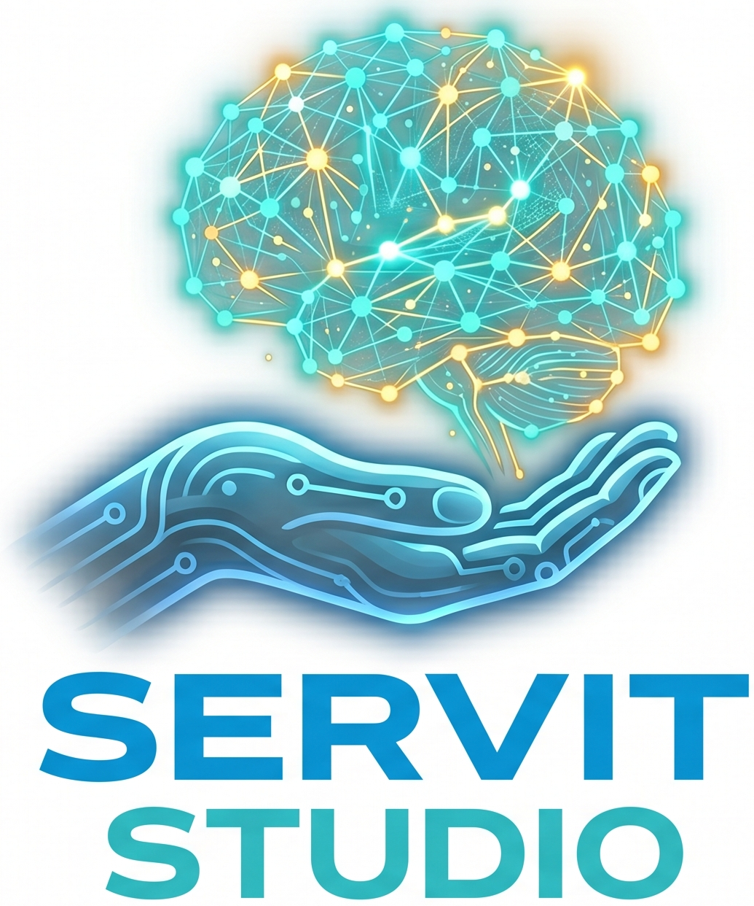

<p align="center">
  
</p>

<h1 align="center">ServeIt Studio</h1>

<p align="center">
  <strong>Automated LLM inference optimization for Kubernetes</strong><br>
  Find the optimal vLLM configuration for your hardware, model, and workload — automatically.
</p>

---

ServeIt Studio deploys real vLLM instances on your cluster, sweeps configurations across aggregated, prefill/decode disaggregated (PD), and expert parallel (EP) architectures, tunes engine parameters from first principles, and returns the optimal setup — ranked by TTFT, throughput, or both.

## Screenshots

### Multi-Cluster Launcher

Manage multiple clusters and optimization instances from a single dashboard. Each cluster shows GPU nodes, VRAM, RDMA capability, and running instances.


### Create a New Instance

Deploy a new optimization instance to any cluster. Select GPU count, storage class, and pin to specific nodes.


### Choose Your Optimization Goal

Select from response time, throughput, balanced, or architecture-specific strategies. Each goal tests different architectures and applies different optimization heuristics.


### Model Gallery

Browse and select from popular open-source LLM models. Filter by size category, architecture (Dense, MoE, Code, Speculative), and quantization format.


### Review & Run

Review your full configuration summary — deployment, workload, and tuning settings — then start the automated optimization pipeline. Live console output shows progress in real time.


### Optimization Report — Throughput vs Latency

Interactive scatter plot showing every tested configuration. Bubble size represents GPU count. The ideal configuration is in the top-left corner (low latency + high throughput). Hover over any bubble to see the exact configuration details.


### PD Configuration Sweep

TTFT, throughput, and inter-token latency (ITL) across all tested prefill/decode splits. The green dot marks the best TTFT, the pink diamond marks the best throughput. Aggregated baseline shown as dashed reference lines.


### GPU Estimator

Estimate how many GPUs you need for a different workload without re-running tests. Adjust concurrency, ISL/OSL, and set a latency SLA — the estimator scales your tested results and shows which configurations meet the target and how many GPUs each would need.


## How It Works

ServeIt Studio supports three inference architectures:

| Architecture | Description | Optimizes For |
|---|---|---|
| **Aggregated** | Single vLLM deployment (baseline) | Simplicity |
| **Prefill/Decode (PD)** | Separate prefill and decode pods with KV cache transfer via NIXL/RDMA | Response time (TTFT) |
| **Expert Parallelism (EP)** | PD disaggregation with expert-parallel flags for MoE models | Throughput |

The optimizer selects which architectures to test based on the goal:

- **Response Time** — Aggregated vs PD
- **Throughput** — Aggregated vs EP
- **Balanced** — All three
- **Aggregated Only / PD Only / EP Only** — Test a single architecture

### The 11-Step Pipeline

1. **Prerequisite Infrastructure** — Deploy gateway, EPP, RBAC, RDMA discovery
2. **Decode TP Sweep** — Deploy aggregated vLLM at each TP (1, 2, 4, 8), measure decode TPSG
3. **Prefill TP Sweep** — Same for prefill workloads (often different optimal TP)
4. **Cluster Capacity Analysis** — Calculate GPU cost per request, sustainable throughput
5. **GPU Sizing & Feasible Splits** — Enumerate valid P/D GPU divisions respecting TP constraints
6. **Aggregated Configuration Search** — Test all aggregated configs (TP1×16R, TP2×8R, etc.)
7. **P/D / EP Split Optimization** — Test selected splits, find Pareto front (or best throughput for EP)
8. **Architecture Comparison** — Compare best PD/EP vs best Aggregated (no new tests)
9. **EPP Tuning** — Smart EPP weight derivation from Prometheus metrics (optional)
10. **Latency-Bounded Throughput** — Binary search for max throughput under latency SLA (optional)
11. **Calibrated Load Validation** — Re-test at sustainable QPS computed via Little's Law (optional)

Steps 2-3 and 6-11 deploy real workloads. Steps 4-5 are pure math.

### Smart Features

- **Model config from HuggingFace** — Reads `config.json` directly for accurate model size, dtype, MoE detection, hybrid attention detection, and FP8 compatibility checks
- **Smart PD Search** — Calculates optimal P/D split from calibration data, tests ~3 configs per TP pair instead of exhaustive sweep
- **Smart max_num_seqs** — Multi-factor formula: `min(S_activation, S_kv, S_concurrency, 512)` adapted per model architecture
- **Smart EPP weights** — Start from preset, adjust ±1 based on measured Prometheus metrics (prefix cache hits, queue depths)
- **Workload-aware min TP** — Computes minimum TP from model weights + KV cache budget for the target workload
- **DeepGemm compatibility** — Auto-detects compressed-tensors per-channel FP8 and disables DeepGemm for incompatible models
- **Hybrid attention detection** — Passes `--no-disable-hybrid-kv-cache-manager` for models with mixed attention types
- **Asymmetric TP** — Allows prefill TP > decode TP (disabled for llm-d v0.4.0 due to NIXL bug)
- **Resume** — Resume interrupted runs from the last completed test

## Prerequisites

- Kubernetes or OpenShift cluster with NVIDIA GPUs
- [LeaderWorkerSet](https://github.com/kubernetes-sigs/lws) CRD installed
- `kubectl` (or `oc`) CLI configured
- A HuggingFace token stored as Secret `llm-d-hf-token` in the target namespace

## Deployment

```bash
# Deploy launcher (multi-user, multi-cluster)
python3 deployment/deploy.py --mode launcher --storage-class <your-class>

# Deploy with an existing PVC
python3 deployment/deploy.py --pvc-name my-existing-pvc

# Sync code to all running pods
python3 deployment/deploy.py --sync-all

# Port-forward the UI to localhost:8080
python3 deployment/deploy.py --port-forward
```

### Access the UI

```bash
# Kubernetes
python3 deployment/deploy.py --port-forward
# Opens http://localhost:8080

# OpenShift (auto-creates Route)
oc get route -n serveit
```

## Multi-Cloud Support

ServeIt Studio auto-detects the cloud provider and configures networking accordingly:

| Provider | GPU Resource | Networking | RDMA |
|---|---|---|---|
| IBM Cloud | DRA (`dra.llm-d.io/gpu-nic-pair`) | DRANet | InfiniBand via DRA |
| CoreWeave | `nvidia.com/gpu` + `rdma/ib` | Shared device plugin | InfiniBand via device plugin |
| Bare Metal | `nvidia.com/gpu` | NAD (Multus) | InfiniBand via Multus |
| AWS / Azure / GCP | `nvidia.com/gpu` | Standard | Provider-specific |

## Metrics

**Client-side** (via [guidellm](https://github.com/vllm-project/guidellm)):
- TTFT (p50, p90, p95, p99)
- Inter-token latency (ITL)
- Throughput (requests/sec)
- TPOT (time per output token)

**Server-side** (via Prometheus/Thanos):
- vLLM TTFT, ITL, E2E latency percentiles
- Token throughput, request queue depth, KV cache utilization
- Pod network and InfiniBand RDMA throughput

Results are stored in SQLite at `/mnt/storage/serveit.db`.

## Project Structure

```
core/                          # Optimization engine
├── optimizer/                 #   Pipeline, config builder, TP calibration, PD search
├── orchestrator/              #   Deploy → benchmark → collect → cleanup
├── templates/                 #   Jinja2 K8s manifests (aggregated, PD, prereqs)
├── networking/                #   Network plugins (DRA, NAD, shared device)
└── providers/                 #   Cloud provider adapters

web/                           # Flask + SocketIO web UI
├── static/                    #   CSS, JS modules, images
└── templates/                 #   HTML wizard steps

launcher/                      # Multi-user launcher
├── app.py                     #   Flask API + dashboard
├── instance_manager.py        #   Instance lifecycle (create, delete, list)
└── templates/                 #   Launcher HTML

deployment/
└── deploy.py                  #   Deploy, sync, port-forward CLI
```

## License

[Apache 2.0](LICENSE)
