# Inftune Studio — System Diagrams

All diagrams use Mermaid syntax and render natively on GitHub.

---

## 1. System Architecture Overview

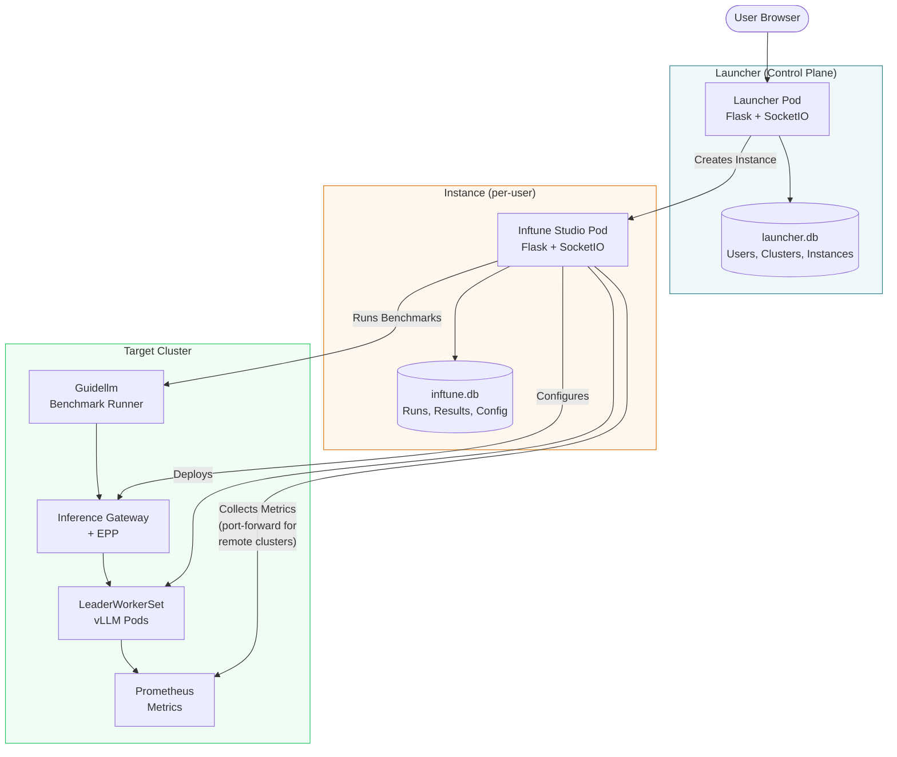

---

## 2. Optimization Pipeline (11 Steps)

```mermaid
flowchart TD
    S1[Step 1: Initialization<br>Scan cluster, detect GPUs,<br>RDMA, cloud provider] --> S2

    S2[Step 2: Decode TP Sweep<br>Test all valid TPs with ISL=1<br>Measure decode throughput] --> S3

    S3[Step 3: Prefill TP Sweep<br>Test all valid TPs with OSL=1<br>Measure prefill throughput] --> S4

    S4[Step 4: Capacity Analysis<br>GPU cost per request,<br>sustainable throughput] --> S5

    S5[Step 5: Feasible Splits<br>Smart PD Search formula,<br>NIXL constraints] --> S6

    S6[Step 6: Aggregated Search<br>Test all TPs at full workload<br>with all GPUs] --> S7

    S7[Step 7: PD / EP Testing<br>Test feasible splits,<br>build Pareto front] --> S8

    S8[Step 8: Architecture Comparison<br>PD vs Aggregated vs EP<br>No new tests] --> S9

    S9{EPP Benchmark<br>enabled?}
    S9 -->|Yes| S9a[Step 9: EPP Tuning<br>Derive weights from<br>Prometheus metrics]
    S9 -->|No| S10

    S9a --> S10

    S10{Latency SLA<br>enabled?}
    S10 -->|Yes| S10a[Step 10: Latency Search<br>Binary search for max<br>throughput under SLA]
    S10 -->|No| S11

    S10a --> S11

    S11{Overloaded?}
    S11 -->|Yes| S11a[Step 11: Calibrated Load<br>Re-test at sustainable<br>concurrency]
    S11 -->|No| DONE

    S11a --> DONE[Results & Report<br>Pareto front,<br>recommendations]

    style S1 fill:#e0f2fe,stroke:#0ea5e9
    style S2 fill:#fef3c7,stroke:#f59e0b
    style S3 fill:#fef3c7,stroke:#f59e0b
    style S5 fill:#f5f3ff,stroke:#8b5cf6
    style S7 fill:#f0fdf4,stroke:#22c55e
    style DONE fill:#ecfdf5,stroke:#10b981
```

---

## 3. Smart PD Search Algorithm

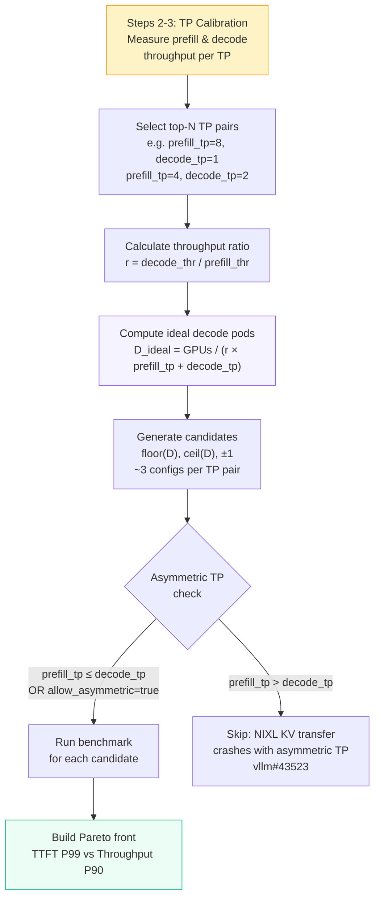

### Comparison: Smart vs Exhaustive Search

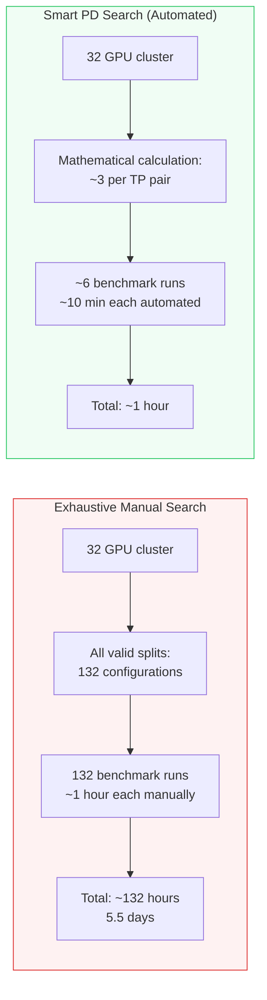

---

## 4. Single Test Execution Flow

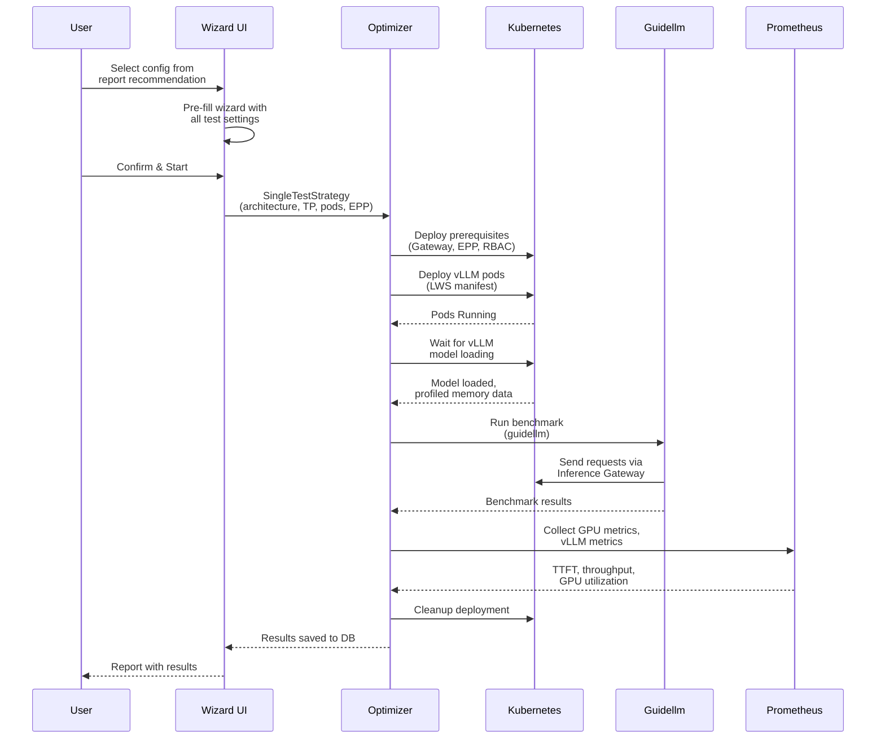

---

## 5. Deployment Lifecycle (PD Architecture)

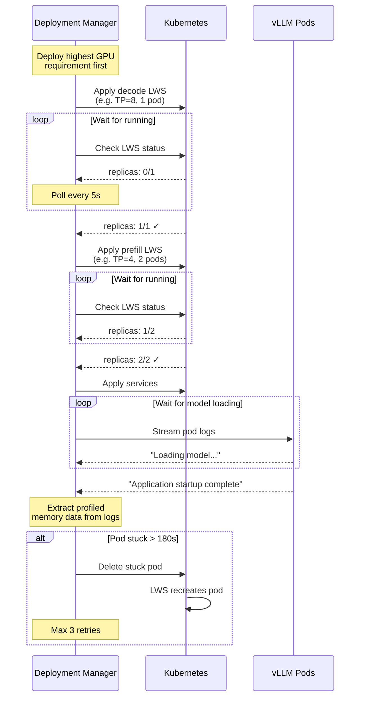

---

## 6. Cluster Scanning & Auto-Detection

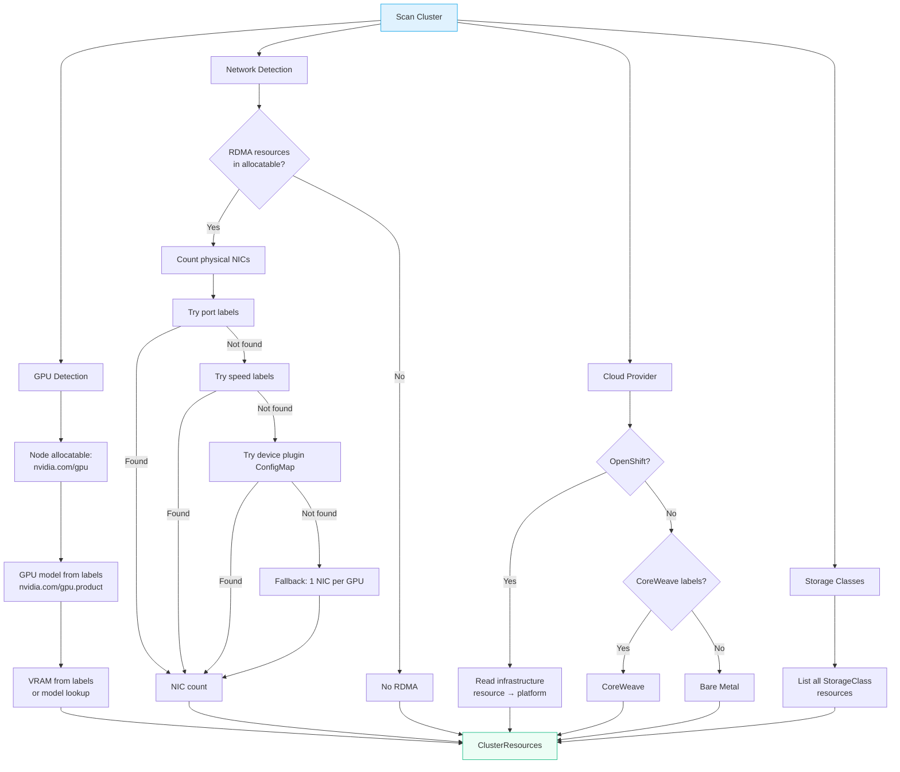

---

## 7. Network Mode Selection

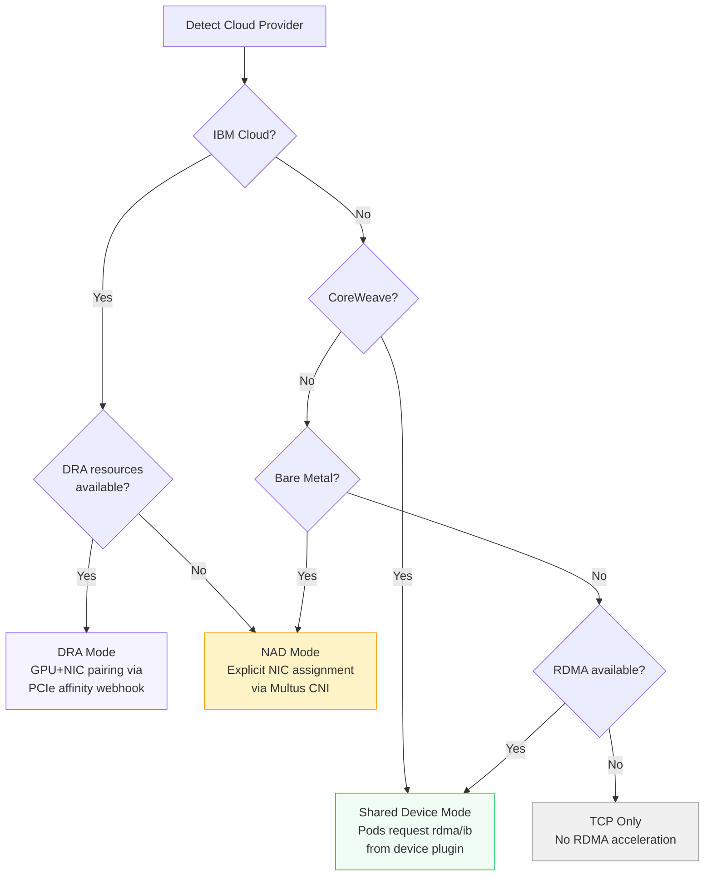

---

## 8. Model Architecture Detection

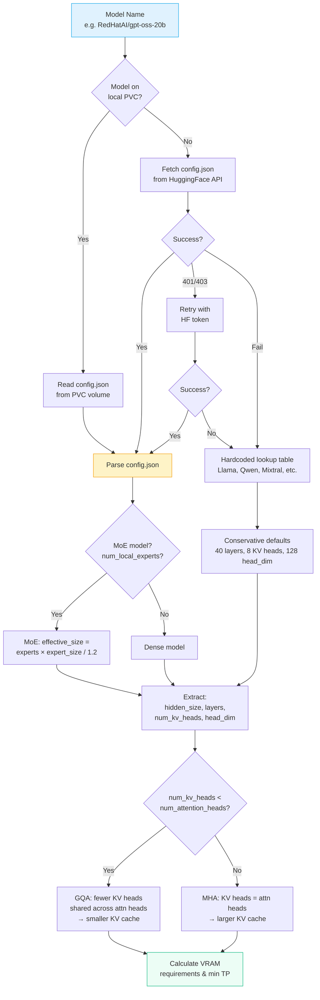

---

## 9. Prefix Cache Simulation Modes

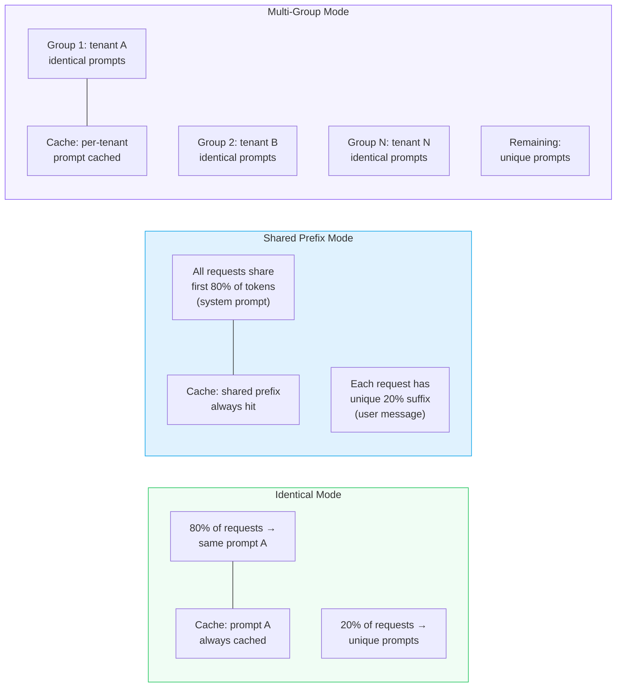

---

## 10. EPP Routing Decision & Metrics-Driven Weight Derivation

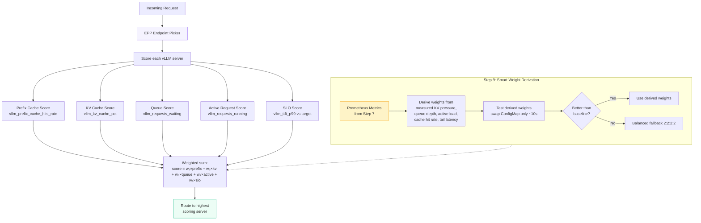

---

## 11. Latency-Bounded Throughput Search (Step 10)

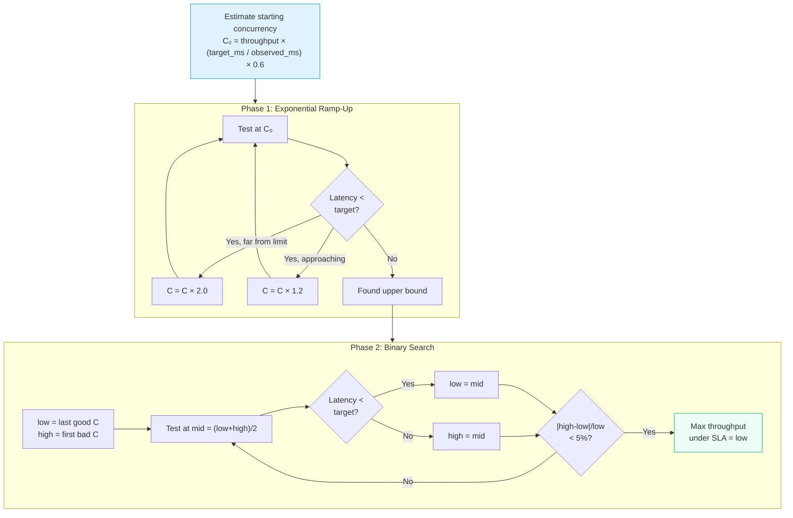

---

## 12. Multi-Cluster Management

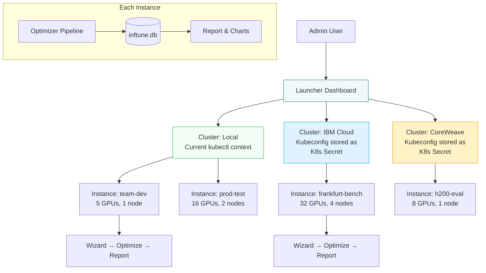
